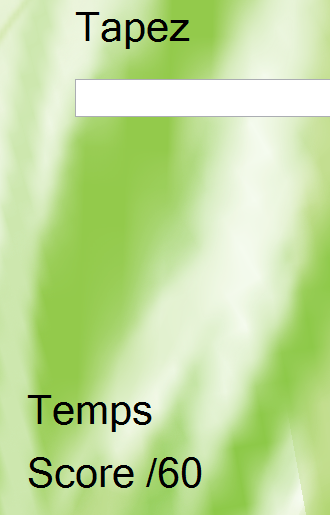

<a href="https://raw.githubusercontent.com/cedced19/Azou/master/setup/Azou.exe" class="btn">Téléchargement</a>
Attendez quelques secondes...

Hello ! Vous voulez apprendre  à utiliser le clavier AZERTY ?
Apprenez le avec Azou !
Tapez 60 lettre en un minimum de temps.
Moins vous metez de temps plus vous êtes rapide.

Le projet est sur [github](https://github.com/cedced19/azou).
