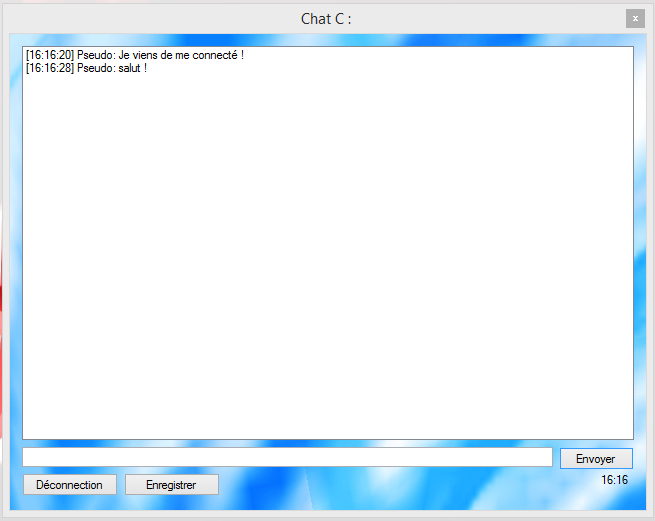

Le chat est basique pour le moment.
"More security" c'est le slogan pour ce chat pas comme les autres !

###Chat C Version Client :
Connectez vous a un serveur via une ip.
[Télécharger le Client](https://raw.githubusercontent.com/cedced19/ChatC/master/setup/ChatC.exe)  
Attendez quelques secondes...

###Chat C Version Serveur :
Cliquez.
[Télécharger le Serveur](https://raw.githubusercontent.com/cedced19/ChatC/master/setup/ServeurChat.exe)  
Attendez quelques secondes...

Ouvrez juste le port 2000 si vous voulez y accéder depuis l'extèrieur de chez vous.
Puis partager l'ip aux futures utilisateurs !

Change the world.

