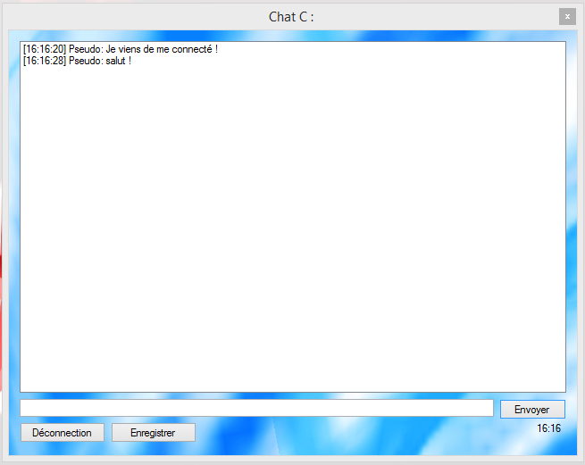

###Chat C

[Download Client](https://raw.githubusercontent.com/cedced19/ChatC/master/setup/ChatC.exe)

[Download Serveur](https://raw.githubusercontent.com/cedced19/ChatC/master/setup/ServeurChat.exe)

Le chat est basique pour le moment.
"More security" c'est le slogan pour ce chat pas comme les autres !

Chat C Version Client :
Connectez vous a un serveur via une ip

Chat C Version Serveur :
Cliquez.

Ouvrez juste le port 2000 si vous voulez y accéder depuis l'extèrieur de chez vous.
Puis partager l'ip aux futures utilisateurs !

It's the extension of the brain.

