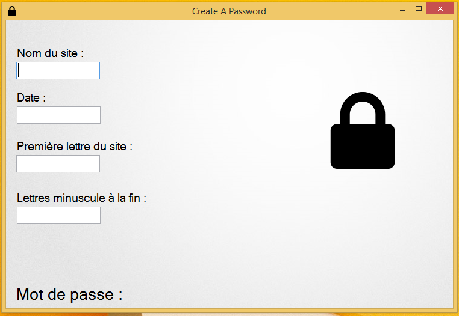

[Téléchargement](https://raw.githubusercontent.com/cedced19/CreateAPassword/master/setup/CreateAPassword.exe){:.btn}

Permet de crée un  mot de passe différent pour chaque site.

## License
[CC BY-SA](http://creativecommons.org/licenses/by-sa/4.0/)
