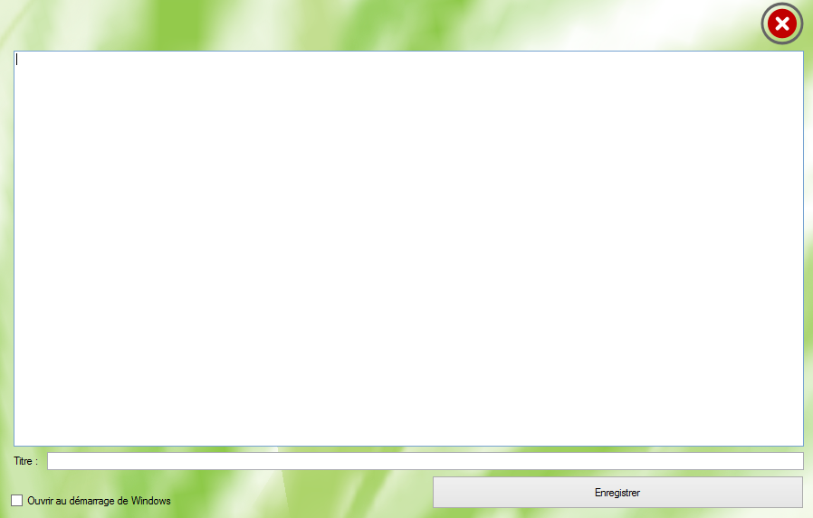

###Notepad C

[Download](https://raw.githubusercontent.com/cedced19/NotepadC/master/setup/NotePadC.exe)
Sur une idée de Charly mon designer, Notepad C a été crée.
Notepad C est un logiciel  qui permet de prendre des notes.
Enregistrement dans le logiciel et sur le bureau disponible.

It's the extension of the brain.

